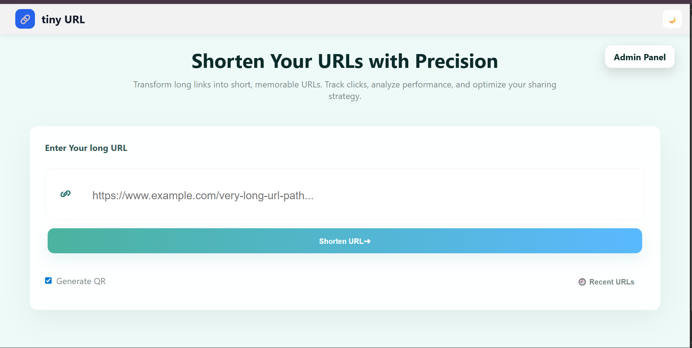
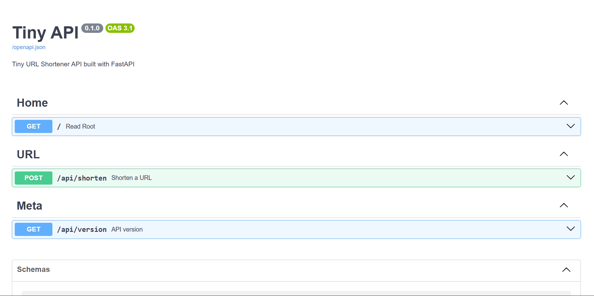

# 🔗 tiny URL Generator

> A modern, Bitly-style tiny URL web application built with Flask, FastAPI & MongoDB


---

## 📌 Overview

**tiny URL** is a sleek, fast, and modern URL shortening platform built using **Flask**, **FastAPI**, and **MongoDB**.  
It converts long URLs into short, shareable links — just like Bitly.

The project supports both:

- 🌐 **Flask Web UI** (end users)
- 🚀 **FastAPI REST API** (developers / integrations)

---

## 🚀 Features

### 🔹 User Features

- Convert long URLs into short, unique codes
- Default checkbox QR code generation
- Clean Bitly-style result card
- Download URL button
- Share URL
- Copy button with animation
- Smooth URL validation and sanitization
- Auto Dark/Light Mode (saves preference)
- Mobile-friendly QR Codes
- Fully responsive design
- Recent URLs page
- Glassmorphism UI

---

### 🔹 API & Developer Features

- REST API for URL shortening
- API version endpoint
- Swagger / OpenAPI documentation
- API landing page
- CLI to run UI or API independently

---

## 🧠 Short Code Generation Algorithm

The app uses a **Random Alphanumeric Short Code Generator**.

### 🔍 Algorithm Details

- Uses Python’s `string.ascii_letters + string.digits`
- Randomly picks characters
- Generates a 6-character short ID
- Checks MongoDB to avoid duplicates
- If duplicate → regenerate automatically

### 🔢 Example

```python
import random, string

def generate_code(length=6):
    chars = string.ascii_letters + string.digits
    return ''.join(random.choice(chars) for _ in range(length))
```

🗃️ Tech Stack

| Layer       | Technology                 |
| ----------- | -------------------------- |
| UI Backend  | Flask                      |
| API Backend | FastAPI                    |
| Database    | MongoDB                    |
| Frontend    | HTML, CSS, Vanilla JS      |
| UI Style    | Glassmorphism, Gradient UI |
| API Server  | Uvicorn                    |
| Validation  | Pydantic v2                |
| CLI         | Click                      |
| Data        | JSON                       |

📁 Project Folder Structure

```text
├── CHANGELOG.md
├── LICENSE
├── README.md
├── app/
│   ├── __init__.py
│   ├── admin.py
│   ├── api/
│   │   ├── __init__.py
│   │   └── fast_api.py
│   ├── app.py
│   ├── assets/
│   │   └── images/
│   ├── cli.py
│   ├── db/
│   │   ├── __init__.py
│   │   └── data.py
│   ├── qr.py
│   ├── static/
│   │   ├── images/
│   │   │   ├── logo.png
│   │   └── style.css
│   ├── templates/
│   │   ├── admin.html
│   │   ├── coming-soon.html
│   │   ├── index.html
│   │   └── recent.html
│   └── utils/
│       ├── __init__.py
│       ├── helper.py
│       └── lint.py
├── mypy.ini
├── package.json
├── poetry.lock
├── pyproject.toml
├── requirements.txt
└── tiny.code-workspace

Directory structure:
tiny/
├── CHANGELOG.md
├── LICENSE
├── README.md
├── app/
│   ├──__init__.py
│   ├── app.py
│   ├── cli.py
│   ├── api/
│   │   └── fast_api.py
|   ├──assets/images
│   ├── db/
|   |    └──__init__.py
|   |     └──data.py
│   ├── utils/
|   |     └──__init__.py
|   |     └──_version.py
|   |     └── helper.py
|   |     └── lint.py
│   ├── static/
|   |     └── images
|   |      └── qr
│   └── templates/
|           └── index.html
|           └── recent.html
|           └── admin.html
├── pyproject.toml
|    └── poetry.lock
├──README.md
|    └── CHANGELOG.md
|    └── requirements.txt
├── tiny.code-workspace
└── .gitignore

```

⚙️ How to Run the Project Locally

## How to start

```sh
poetry install
poetry install --all-extras --with dev
```

create `.env` file and add content from `.env.local` file anc change value according to your project

Note: according to your port change the port in `frontend/vite.config.ts` and `VITE_API_URL`

```sh
poetry shell
poetry run tiny dev
```

## Lint

to lint the code run

```sh
poetry run black .
#then
poetry run ruff .
```

open [http://localhost:8000](http://127.0.0.1:8000)

🔗 How the App Works
▶️ User Flow
1.User enters a long URL

2.System sanitizes + validates input

3.Generates a unique short code

4.Saves it in MongoDB

5.Displays short URL + QR code

5.Clicking the short URL:

- Increases visit count

- Redirects to original URL

## 🔌 REST API (FastAPI)

Tiny provides a FastAPI-based REST API for programmatic URL shortening.

▶ Run API Server

```sh
poetry run tiny api
```

📍 API Base URL

open [http://localhost:8001](http://127.0.0.1:8001)

🌙 tiny API Landing Page

open [http://localhost:8001](http://127.0.0.1:8001)

📘 Swagger Docs

open [http://localhost:8001/docs](http://127.0.0.1:8001/docs)

➤ Shorten URL

POST `/api/shorten`

Request:

```json
{
  "url": "https://example.com"
}
```

Response:

```json
{
  "input_url": "https://examplecom",
  "output_url": "http://127.0.0.1:8001/AbX92p",
  "created_on": "2026-01-03T13:25:10+00:00"
}
```

➤ API Version

GET `/api/version`

Response:

```json
{
  "version": "0.0.1"
}
```

📜Docs
[run_with_curl](run_with_curl)

Screenshots:
Home Page:



tiny API Page:



📜License
[License](LICENSE)
