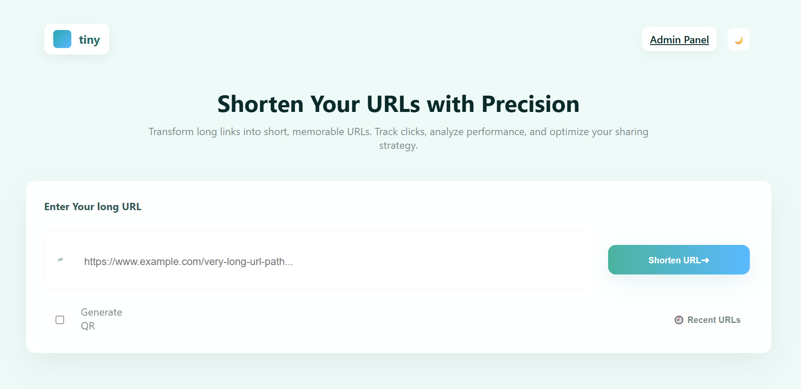
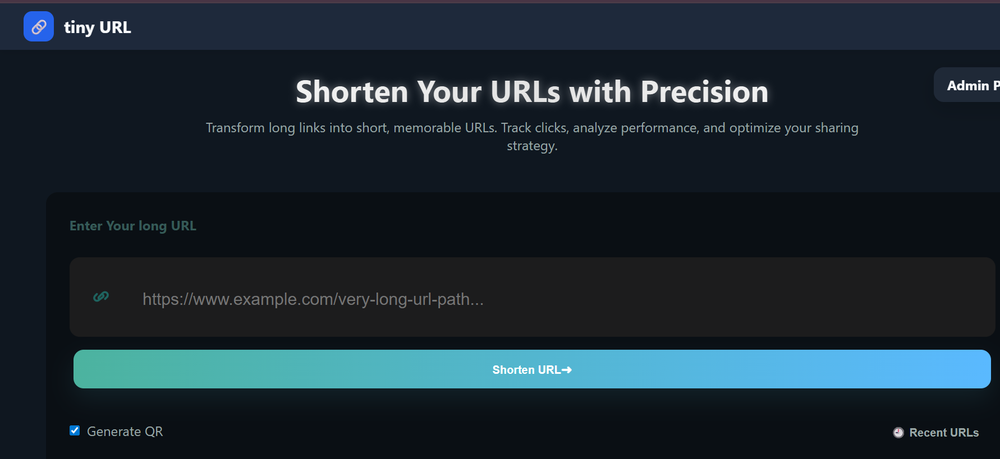
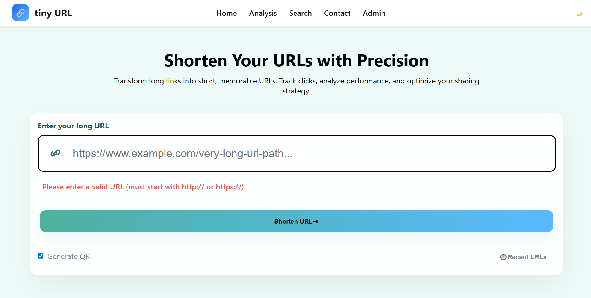
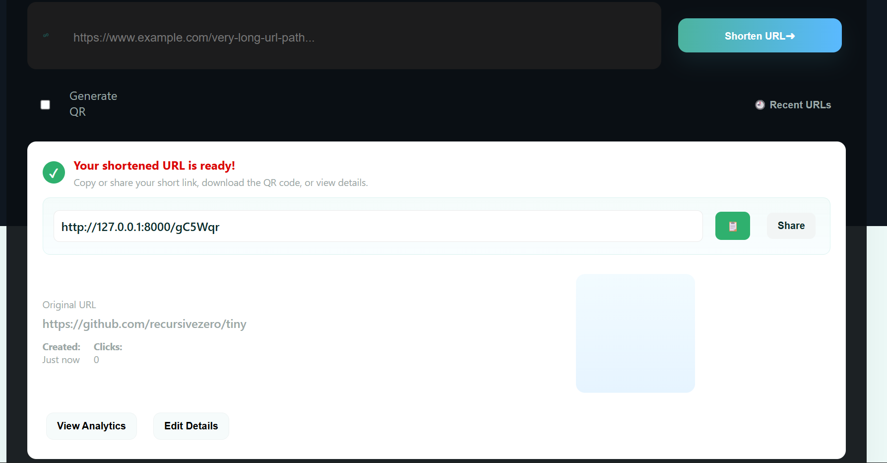
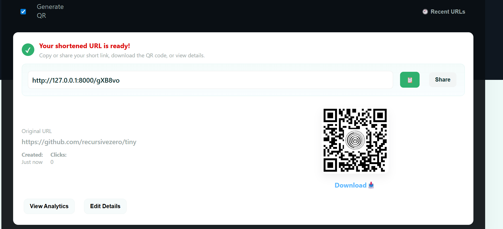
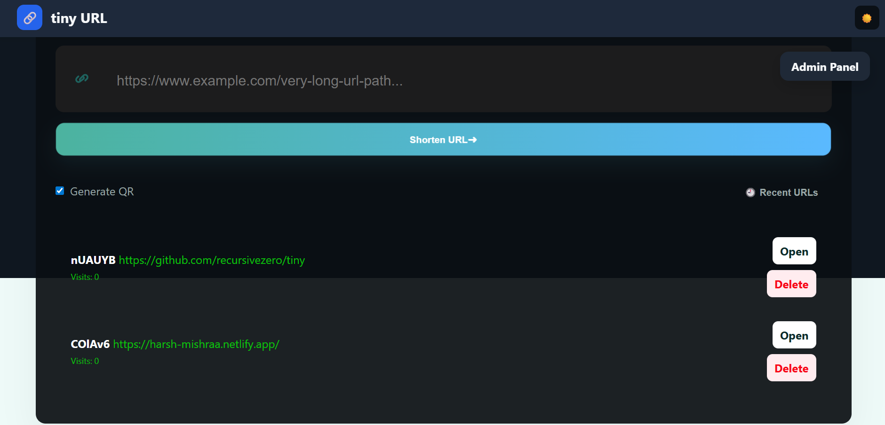
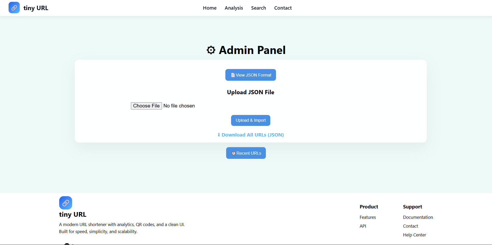
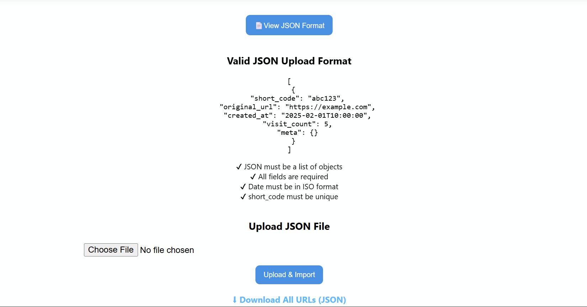

# 🔗 Short URL Generator

> A modern, Bitly-style URL shortening web application built with Flask & MongoDB\_


---

## 📌 Overview

**Short URL Generator** is a sleek, fast and modern URL shortening platform built using Flask and MongoDB.  
It converts long URLs into short, shareable links — just like Bitly.

It supports:

- URL shortening
- QR Code generation (Short URL or Original URL)
- Visit counting
- MongoDB database
- JSON import/export (Admin Panel)
- Input validation + sanitization
- Light/Dark Mode with memory
- Glassmorphism UI
- Copy-to-clipboard button
- Delete confirmation popup

This project is perfect for learning **Flask**, **MongoDB**, **Web UI design**, and **clean backend development**.

---

## 🚀 Features

### 🔹 User Features

- Convert long URLs into short, unique codes
- QR code generation
- Clean Bitly-style result card
- Download URl button
- share URL
- Copy button with animation
- Smooth URL validation and sanitization
- Auto Dark/Light Mode (saves preference)
- Mobile-friendly QR Codes
- Fully responsive design

### 🔹 Admin Panel Features

- View all shortened URLs
- Delete URLs (with confirmation popup)
- Import URLs using JSON file
- Export database to JSON
- Shows JSON format guide
- Strict JSON validation

---

## 🧠 Short Code Generation Algorithm

The app uses a **Random Alphanumeric Short Code Generator**.

### 🔍 Algorithm Details

- Uses Python’s `string.ascii_letters + string.digits`
- Randomly picks characters
- Generates a 6-character short ID
- Checks MongoDB to avoid duplicates
- If duplicate → regenerate automatically

### 🔢 Example

```python
import random, string

def generate_code(length=6):
    chars = string.ascii_letters + string.digits
    return ''.join(random.choice(chars) for _ in range(length))
```

🗃️ Tech Stack

| Layer        | Technology                               |
| ------------ | ---------------------------------------- |
| Backend      | Flask (Python)                           |
| Database     | MongoDB                                  |
| Frontend     | HTML, CSS (Glassmorphism), Vanilla JS    |
| QR Generator | `qrserver.com` API                       |
| Hosting      | Local / PythonAnywhere / Render / Heroku |
| Component    | Technology                               |
| UI Style     | Glassmorphism, Gradient UI               |
| Data Format  | JSON                                     |

📁 Project Folder Structure

```text

Directory structure:
└── tiny/
    ├── CHANGELOG.md
    ├── LICENSE
    ├── README.md
    ├── app/
    │   ├── __init__.py
    │   ├── app.py
    │   ├── assets/
    │   │   └── images/
    │   │       ├── Dark_mode.png
    │   ├── cli.py
    │   ├── database.py
    │   ├── models.py
    │   ├── static/
    │   │   ├── images/
    │   │   │   ├── logo.png
    │   │   │   └── url_shortener_bg.jpg
    │   │   └── style.css
    │   └── templates/
    │       ├── admin.html
    │       └── index.html
    ├── package.json
    ├── pyproject.toml
    └── poetry.lock
    ├── requirements.txt
    └── tiny.code-workspace
    └── .gitignore
    └── .flake8
    └── .env
```

⚙️ How to Run the Project Locally

## How to start

```sh
poetry install
poetry install --all-extras
```

create `.env` file and add content from `.env.local` file anc change value according to your project

Note: according to your port change the port in `frontend/vite.config.ts` and `VITE_API_URL`

```sh
poetry shell
poetry run tiny dev
```

## Lint

to lint the code run

```sh
poetry run black .
#then
poetry run ruff .
```

open [http://localhost:8000](http://127.0.0.1:8000)

🔗 How the App Works
▶️ User Flow

User enters a long URL

System sanitizes + validates input

Generates a unique short code

Saves it in MongoDB

Displays short URL + QR code

When someone clicks the short link →

Visit count increases

User redirected to original URL <http://127.0.0.1:5000/abc123> Someone clicks it → visit count increases → redirected to original URL

🧩 Short Code Generation Algorithm

Uses characters: a–z, A–Z, 0–9

Random 6-character string

Ensures uniqueness by checking database

If code exists → generate again

Saves final unique code

🗄️ Database Schema (SQLAlchemy Model)

| Field        | Type      | Description        |
| ------------ | --------- | ------------------ |
| id           | Integer   | Primary Key        |
| short_code   | String    | Unique short ID    |
| original_url | String    | Long URL           |
| created_at   | DateTime  | Timestamp          |
| visit_count  | Integer   | Click count        |
| meta         | JSON Text | Title, notes, tags |

📦 JSON Import Format (Admin)

Example JSON file for bulk import:

[
{
"short_code": "abc123",
"original_url": "https://example.com",
"created_at": "2025-11-18T23:59:00Z",
"visit_count": 42,
"meta": {
"title": "Example Page",
"notes": "Optional notes",
"tags": ["test", "demo"]
}
}
]

📤 Export Format

Admin can download all URLs in the same JSON format.

Screenshots:
Home Page:






Admin Page:



📜License
[License](LICENSE)
